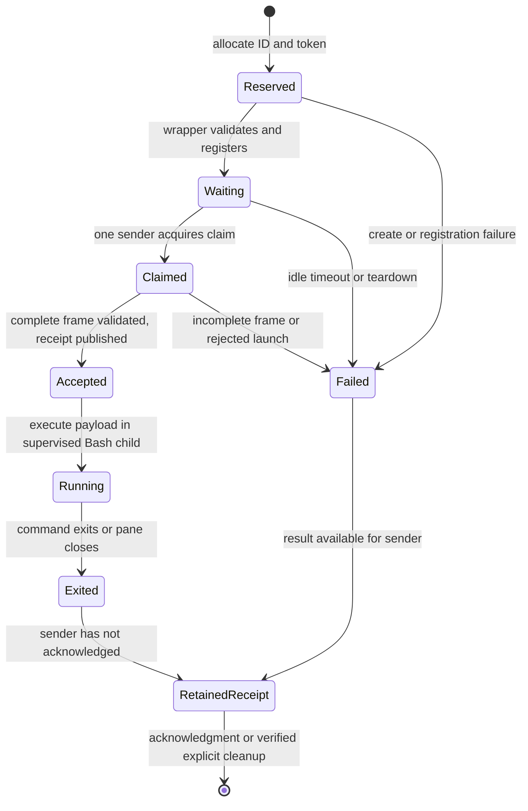

# Repository stabilization design

**Status:** Design and planning deliverable; implementation has not started.

**Baseline:** Production tree at `93ed78831b0745d0cfa3b33ba085298f8855ef93`, containing merged #8/#9. Local integration is `8e4e33d`; the first audit/plan commit is `80beff5`.

**Purpose:** Give a future development task sufficient decisions, interfaces, test expectations, and delivery boundaries to proceed without this conversation.

Read this design before the [execution plan](../plans/2026-09-14-repository-cleanup.md). The [audit](../reviews/2026-09-14-pr-audit.md) describes observed behavior, not the behavior specified below. The August design is historical. If they differ, this design governs the proposed implementation.

## 1. Scope and selected approach

Retain the Bash tmux adapter, Zellij panes, and one FIFO per waiting pane. Keep #8's deferred startup and #9's targeted placement. Stabilize the core before incorporating fish and the remaining optional features. Use the shared changes in #2/#5 once, with attribution, adapting their obsolete assumptions.

The selected approach is staged consolidation. A targeting-only patch leaves shared-state and shell-lifecycle failures unresolved. A general tmux replacement or daemon rewrite would expand the project substantially. Neither is needed for the supported Agent Teams protocol.

The design makes the following decisions now:

| ID | Decision | Reason |
|---|---|---|
| D01 | Separate single-string shell programs from literal argv | Both forms are supported by tmux and require different encoding |
| D02 | Use a framed, single-use FIFO launch and durable receipt | Timeout must not execute partial input; fast exits must not erase acceptance |
| D03 | Introduce a v2 runtime namespace; do not migrate live state | Old wrappers cannot interpret the revised delivery protocol safely |
| D04 | One installed Bash state helper, shared by all shell adapters | State identity and cleanup cannot drift between bash and fish |
| D05 | Snapshot exported environment per pane | Two leaders must not share the first leader's environment |
| D06 | Preserve session-wide deactivation; retain counters and metadata | Avoid ID reuse, deleting live locks, and accidental per-tab promises |
| D07 | Prefer targeted Zellij text, byte, and close operations | Avoid focus dependence and unsupported PID-to-process-group assumptions |
| D08 | Conservative bounded locks, no automatic stale-lock stealing | Missing/dead owner observations do not make a remove/recreate race safe |
| D09 | Minimal CI accompanies the initial baseline harness | Every later semantic change gets regression checks immediately |
| D10 | Fish and each #6 component have separate acceptance gates | Account for each contribution without mixing unrelated feature readiness |

Non-goals: full tmux command/key emulation; replacing already-running commands through respawn; arbitrary pane resizing/reparenting; per-tab deactivation; hot upgrades or automatic legacy-state migration; arbitrary capture buffers/ranges; automatic shell-config edits; release tags; and claiming an authenticated Claude conversation from stand-in commands.

Planning completion means these documents, evidence, and handoff are committed. Repository stabilization completion means the later implementation and its gates pass. These are different milestones.

## 2. Components and interfaces

| Component | Responsibility |
|---|---|
| `bin/tmux` | Narrow parser, supported-command dispatch, command encoding, target resolution, capability checks, launch delivery |
| `bin/zellij-pane-wrapper` | Register a reserved pane, restore its environment, read a complete frame, publish acceptance, run the command, clean owned state |
| `libexec/zellij-shim-state` | Shared Bash functions and a narrow CLI for state identity, validation, locks, reservation/registration, and teardown |
| `activate.sh` / `deactivate.sh` | Thin bash/zsh adapters; save/restore the caller environment transactionally |
| `activate.fish` / `deactivate.fish` | Thin fish adapters using the same helper, introduced with #7 |
| `functions/claude-zellij.fish` | Optional child-fish activation followed by Claude execution |
| Installers | Copy the complete manifest, preserve modes, report upgrade/uninstall behavior |
| Test harness | Exercise real wrappers against controlled Zellij capabilities and real shell interpreters |

The helper is one file, executable as a CLI and sourceable by Bash executables. Sourcing defines functions without changing shell options, traps, PATH, or umask. Its CLI supports:

```text
zellij-shim-state prepare SESSION_NAME          -> canonical session path, one line
zellij-shim-state validate STATE SESSION_NAME   -> no stdout; status only
zellij-shim-state close STATE SESSION_NAME      -> no stdout; status only
```

These are data interfaces, never generated shell code. Fish must not eval helper output. Bash `bin/tmux` and the wrapper source the helper for operations that need to retain lock ownership or write the caller's exported environment. Internal functions cover reservation, registration, identity verification, locking, result publication, and pane cleanup; they do not print protocol output.

Keep the shared identity/capability/close primitives needed for teardown in this helper as well. Driver `kill-pane` and helper `close` call the same verified pane-close operation; do not create a second weaker cleanup backend. Public driver operations enforce caller-group routing. Session-wide `close` uses an explicit internal teardown context that may enumerate all owned groups after setting closing, while preserving every identity/type/ownership check. Closing blocks new reservations/registrations, not the verified teardown operations themselves.

`prepare` creates/validates private state and returns a path only after success. `validate` never sources an environment snapshot. `close` performs the session-wide teardown in section 6. Every mutation revalidates its target; `ACTIVE=1` and the exported root are not sufficient proof.

Dependency additions are limited to this installed Bash helper and standard macOS/Linux utilities already available on supported systems, including `ps`, `cksum`, `stat`, and `mkfifo`. Python is permitted for test orchestration and archived review probes, not required by the production shim. Fish remains optional.

## 3. Command and target contract

### 3.1 Parser and outputs

Only consume `-S VALUE`, `-SVALUE`, `-L VALUE`, and `-LVALUE` before the subcommand. A missing value is a syntax error before any state change. Launch parsers (split-window/new-window/respawn-pane) stop at `--` or their first command operand; everything afterward is payload, including empty strings and arguments named `-S`, `-L`, or `-t`. Query/control handlers parse their own documented ordering, including a display-message target after the format. Send-keys treats operands after its target/options or explicit -- as key/text tokens; it never strips embedded socket-looking text.

Keep an explicit table of accepted compatibility flags and deliberate no-op commands from the existing dispatch. Unknown options on a handled command and unknown commands must return a diagnostic, not silently succeed or forward a stripped command into real tmux. Genuine user tmux use outside activation continues through the normal PATH.

Exit codes: `0` for a supported operation accepted/completed or a documented no-op; `1` for runtime/state/capability failure; `2` for malformed or unsupported command syntax. Diagnostics go to stderr. Split/new-window with `-P` produce exactly `%N\n` after readiness and, for an inline command, acceptance. Zellij output never leaks into that stream. A failed creation may consume an ID; IDs are never rolled back.

| Command | Supported meaning |
|---|---|
| `split-window` | Create an agent in the calling leader group; first beside leader, later below latest live sibling |
| `new-window` | Create a pane beside the caller/leader; retain existing virtual-window behavior, not a real tmux window |
| Creation with no command or exactly one argument `cat` | Leave wrapper waiting for one launch |
| `respawn-pane -k -t %N -- ...` | Deliver the first real command to a waiting agent; never replace a running process |
| `send-keys -t %N ...` | Legacy launch text while pending; terminal text afterward; C-c takes a separate control path |
| `select-pane -t %N -T TITLE` | Set a pending agent's title; running-pane retitling is outside this change |
| `display-message -p '#{pane_id}' [-t %N]` | Return the validated explicit synthetic target, or the caller's synthetic ID when omitted |
| `list-panes [-t main:0]` | Host `%0` plus live agents in the caller's leader group; other groups are not implicitly returned |
| `kill-pane -t %N` | Close one validated shim-owned agent; `%0` is not a killable shim agent |
| Existing virtual session/window queries and layout/options no-ops | Preserve the observed compatibility subset; document its limits |

Public agent targets are `%N`, with canonical decimal N and no leading zero except `%0`. Reject negative numbers, paths, plugin IDs, leading-zero aliases, and arbitrary actual Zellij IDs. Creation accepts contextual `main`/`main:0`, `%0`, or a live member of the caller's group as compatibility selectors. It still follows the documented group placement rule; cross-group/session placement is rejected rather than silently redirected.

`%0` is contextual. In a leader shell it maps to that shell's `ZELLIJ_PANE_ID`; in an agent it maps to its recorded leader `.group`. Never store a global `0.zellij_id`. Live agent operations require a valid terminal ID, matching reservation token, and verified live wrapper identity. Missing/stale routing fails before a Zellij operation. Receipt authentication is separate and uses retained private token records without requiring a living wrapper. Host text/capture routing is allowed; host respawn, pending-title mutation, and kill are rejected.

### 3.2 Launch encoding

One command argument is a Bash shell program, assigned directly to the command variable. Do not pass it through command substitution: that removes trailing newlines. Two or more arguments are literal argv; encode each with Bash `printf %q` and prefix the resulting simple command with `command -- ` before evaluation. The prefix prevents argv[0] such as `if`, `VAR=x`, or `-v` being reinterpreted as shell grammar or options to the command builtin.

The registered wrapper remains a supervisor and runs the program in a child Bash, using the same absolute interpreter as the wrapper. It waits/reaps the child, propagates its final status, and owns state cleanup. Payload `exec`, `exit`, traps, or shell-option changes must not replace or alter the supervisor. Start the payload with normal noninteractive Bash options rather than inheriting supervisor-specific errexit/nounset. It does not emulate an arbitrary tmux `default-shell`. The [tmux manual](https://man.openbsd.org/tmux#COMMANDS) distinguishes shell strings and multi-argument direct execution; the adapter preserves their argument/expansion intent within its Bash execution model.

The exact single-argument `cat` deferral applies only to creation. `cat file`, a shell program containing `cat`, and `respawn-pane ... -- cat` are real commands. Empty respawn payloads are rejected. Multiple argv may contain empty non-command arguments and literal metacharacters.

`send-keys` is text, not launch argv: retain the existing space-joined text and implicit-final-newline subset. Recognized Enter/C-m tokens do not become literal text. C-c alone never delivers an empty launch or newline. If C-c and text are mixed, perform control first and send text only if control succeeds; a pending pane rejects C-c rather than treating it as launch input. Broader literal-key mode and arbitrary named keys remain unsupported.

### 3.3 Capabilities and focus

Capture help output and its exit status before searching it. Avoid `grep -q` in a pipefail pipeline where early pipe closure can masquerade as a failed capability. Cache results only within one invocation; do not persist a version-derived capability guess across upgrades.

Probe independently: no-focus creation, targeted rename, targeted text write, targeted byte write, targeted close, targeted screen dump, and legacy focus support. Creation uses no-focus only when both creation and targeted rename are available, preserving #9's fix for 0.44.0.

Modern late text is `write-chars --pane-id ID TEXT`. Modern kill is `close-pane --pane-id ID`. Older fallback is validated focus, then the requested operation, with failure propagation and a shared lock serializing shim-originated focus operations. Never write/close after focus failure. A failed advertised targeted operation is a failure, not a reason to retry in the focused pane.

The modern path preserves focus. Legacy focus-plus-operation is two separate operations and cannot guarantee atomicity against a user's concurrent click. Document this narrower guarantee. Legacy creation remains focus-dependent; do not promise #9's cross-tab placement protection on unsupported versions.

### 3.4 Placement and titles

A group spawn lock covers predecessor selection, reservation/creation, and ready/actual-ID registration. It is released before waiting for a deferred command or writing a launch. Select the highest valid live synthetic sibling numerically. Simultaneous siblings must not both choose the leader as their first anchor. Different groups may create independently.

The short metadata lock is never held over a Zellij call. Under it, publish a reservation before spawning; wrapper registration rechecks the token and teardown state. If teardown begins during creation, registration fails and the new wrapper exits with close-on-exit. This closes the race without holding metadata locks during UI work. Legacy creation may hold group then focus; release its focus mutex after the creation operation and before delivery/receipt waiting. The wrapper later acquires focus independently for validated focus-plus-rename if targeted rename is absent. A sender must never hold focus while waiting for a wrapper that needs it to finish naming.

Title precedence is pending `select-pane -T`, then an agent name extracted from original argv, then creation's `new-window -n`. For raw shell programs, retain only the existing simple best-effort agent-name inference; never execute text to discover its title. Rename errors generate a warning but do not falsely claim the command was not launched. A receipt is independent of `.named`.

## 4. Runtime state and identity

### 4.1 Namespace and file contract

Use this layout:

```text
<physical-runtime-base>/zellij-tmux-shim-<uid>/v2/<slug>-<cksum>-<bytecount>/
  schema                 # exactly 2
  session.raw            # exact original session-name bytes
  next_id                # positive decimal, monotonic
  sessions               # virtual-session bookkeeping
  metadata.lock/owner
  focus.lock/owner
  group-<leader-id>.lock/owner
  closing                # unfinished teardown blocks registration
  N.reserved             # token and creator identity
  N.phase                # atomic token/state record; terminal states are exited/failed
  N.pid, N.identity      # wrapper process identity
  N.zellij_id, N.group
  N.env                  # this launch's environment only
  N.fifo, N.ready
  N.claim/owner           # one launch writer; retained until cleanup
  N.title, N.named
  N.cmd                  # framed reader output, temporary
  N.result               # durable accepted/error receipt
```

Compute the 48-byte ASCII slug using `LC_ALL=C` and #2's replacement/collapse rules, falling back to `default`. Append the POSIX cksum checksum and byte count. Compare existing `session.raw` byte-for-byte before joining: a collision must fail. This replaces the earlier plan's unspecified cross-shell hash format.

Resolve the existing runtime base with empty CDPATH and `pwd -P`, accepting macOS `/tmp` and `/var` aliases at that base. Reject symlink/non-directory objects below it at the per-user root, v2, and session levels. Verify current UID before chmod or reading content; require private directory mode 0700 and private regular state-file mode 0600. Use umask 077 inside helper operations and restore any caller umask.

Allow spaces in paths. Reject newline-bearing filesystem paths because helper output is line-delimited, and reject colon in the installation path because PATH cannot represent it. Reject existing state objects of the wrong type, including symlinks where a regular record/FIFO is required.

An explicit state path passed to a wrapper must have the exact physical root/v2/session structure, current-user ownership, supported schema, expected session identity, and matching reserved pane token before the wrapper reads `N.env`. This validation works before restoration of the leader's XDG environment. A lexical prefix check or exported ROOT alone is insufficient.

These controls defend against accidental corruption, unsafe cleanup paths, and other users preplacing objects in shared temporary storage. They are not a sandbox against an attacker already controlling this user's account or installed shim code.

### 4.2 Process identity and IDs

Generate a token from 16 bytes of `/dev/urandom`, encoded as 32 lowercase hex. Wrapper positional arguments are exactly STATE INSTALL %N TOKEN, with the token last. Record PID, numeric UID, and trimmed `LC_ALL=C ps -p PID -o lstart=`. Before trusting a pane mapping, compare current UID/birth and require `LC_ALL=C ps -ww -p PID -o args=` to end with that exact whitespace-delimited token. Do not parse the entire flattened argv, which is ambiguous for paths with spaces. `kill -0` alone is only a liveness hint. Missing/ambiguous identity fails closed. Tests use actual controlled wrapper processes rather than arbitrary live PIDs.

Use `ps` interfaces verified on both macOS and Linux for the UID/birth/command check; tests must force a mismatched birth stamp and token. Do not use a filename PID as authority for an OS signal. The selected production kill backend is targeted pane closure, so no negative-PID/process-group fallback is required.

Allocate under the metadata lock: validate the counter, refuse overflow, atomically replace it, and publish the reservation before unlocking. Define the portable maximum as 2147483647; exhaustion returns an explicit error. Never reset a corrupt counter to 1 in existing state. Counter creation happens only when initializing a verified empty new session. Gaps after failed creates are valid.

### 4.3 Locks and recovery

Use atomic mkdir mutexes with owner token plus process identity. Acquisition waits at most 10 seconds, then fails without deleting the owner's files. A creator records ownership before entering its critical section. Normal EXIT/INT/TERM paths release only mutexes they acquired and whose token still matches. This applies to metadata, group, and focus mutexes. `N.claim` is a durable single-use marker, not a mutex: sender exit/interruption and unknown outcome never release it automatically.

Do not automatically reclaim a mutex because its PID is absent or dead: an owner may be paused before publishing metadata, and checking then removing can erase a replacement lock. Recovery is explicit: stop all team creation in the affected session, close remaining team panes through Zellij, verify recorded creators/wrappers and mutex owners are absent or identity-mismatched, and verify no pending reservation is still being created. Only then remove the exact orphan mutex's regular `owner` file and use `rmdir` on that mutex directory. Preserve schema/counter and unrelated records. A same-named Zellij restart alone is insufficient because the directory is deterministic. Exclude `N.claim` from this procedure; unresolved reservations/receipts use verified pane teardown, not mutex recovery. If quiescence cannot be established, return the blocking state path for inspection without deleting it.

Ordering when multiple mutexes are needed: group, then focus, then metadata. Claim acquisition is nonblocking and separate from mutex ownership. Never wait for group/focus while holding metadata. Teardown sets `closing` under metadata, releases it, then performs bounded pane operations. Wrappers only hold metadata briefly for registration/state publication; they never acquire a group lock and acquire focus independently only for legacy naming.

### 4.4 Per-pane environment

The creator writes `N.env` atomically before creating the pane, using exported variable names and `%q`-quoted values. Do not grep an `export -p` text stream: matching text inside a multiline value can corrupt it. Exclude shell internals and values the new pane must establish itself, including actual Zellij pane ID, TMUX_PANE, PWD/OLDPWD/SHLVL and readonly Bash internals.

Preserve the real wrapper Zellij ID before restoration. Validate the snapshot's type, ownership, mode, and reservation token, then restore it and override the pane-specific shim variables. Restoration failure aborts startup. Remove `N.env` after successful restoration. No session-wide `parent.env` remains in v2.

Environment and command payloads must never be attached to CI artifacts or emitted in normal diagnostics. Debug logs record operation/target/token suffix/status rather than a full environment or command string.

## 5. Launch lifecycle and failure behavior



1. Creator reserves ID/token and writes group/environment metadata. It starts the wrapper with explicit state/install/ID/token arguments.
2. Wrapper installs cleanup traps before publishing files, validates its reservation, rejects `closing`, records actual pane/process identity, creates FIFO and reader, then publishes ready. Creator releases the group spawn lock after readiness and verified ID registration.
3. A sender acquires `N.claim` exactly once. Another launch sender fails even if the FIFO still exists. The claim outlives the delivery and is removed only as part of that pane's verified cleanup.
4. Sender writes `printf '%s\0' "$COMMAND_TEXT"` in an owned child process. NUL is a completeness marker; command arguments cannot contain NUL. Writer open and write are both covered by the deadline.
5. Wrapper's bounded reader captures the frame, checks reader completion, and uses `IFS= read -r -d ''` to require the terminator without dropping trailing newlines. Reject missing terminator, empty program, extra bytes after the single frame, or nonzero reader status. Never evaluate truncated input.
6. After validation and the naming attempt, wrapper atomically publishes `N.result` with matching token and `accepted` immediately before launching its supervised child. This means accepted for execution, not command completion or success. The stable supervisor owns its child status and cleanup even when the payload uses exec.
7. Caller validates and consumes the receipt against schema, private file ownership, and the matching immutable reservation token; no live-wrapper check is required for receipt reading. Wrapper EXIT publishes terminal `N.phase` and retains unconsumed `N.result`, `N.reserved`, `N.phase`, and `N.claim`. Thus `true` or another short-lived command can finish before the next poll without losing acceptance. A terminal reservation retained for a receipt is not an in-flight spawn.

Phase values are reserved, waiting, claimed, accepted, exited, or failed, paired with the token and atomically replaced under metadata lock. After receipt acknowledgment, remove the receipt immediately; retain reservation/claim while the supervisor is alive. If the phase is already terminal, the acknowledgment path retires that entire remaining authenticated record set. Conversely, wrapper cleanup can retire those records when no receipt remains. Both paths use metadata locking so neither erases the other's evidence prematurely.

Defaults: readiness 5 seconds; complete delivery plus acceptance 5 seconds after claim; unused waiting pane 300 seconds. Measure elapsed deadlines rather than multiplying attempts by an assumed fractional sleep. A platform's integer-sleep fallback may add one poll interval, not turn 5 seconds into 50. Tests use external watchdogs and verify the actual blocked operation is bounded.

If a writer times out, terminate and reap only that exact owned child. A partial frame is rejected by the wrapper. If complete delivery happened but no receipt is observed before the deadline, report **launch outcome unknown** and never automatically resend, kill, or delete an apparently live pane. Preserve diagnostic metadata for inspection. New explicit attempts see the consumed claim and fail rather than execute twice.

Creator owns reservation/environment and failed-create cleanup until wrapper registration. Wrapper owns runtime cleanup after registration. A caller timeout does not transfer that ownership back. Cleanup uses a centralized allowlist and token checks; it reaps the wrapper's reader and removes transient `.env`, `.cmd`, FIFO, ready, title/named, and matching runtime records. Receipts are removed by acknowledgment or verified explicit teardown, not by a racing wrapper EXIT trap.

## 6. Shell activation, deactivation, and upgrades

### Activation

Compute local candidates, validate installation/helper completeness, call `prepare`, and only then change exported state. Failed activation leaves environment, shell options, and umask unchanged; an empty private directory created by the attempt may remain.

At first success save original PATH plus the set/unset status and values of TMUX and TMUX_PANE. Keep the first activation baseline on re-source and inherited activation. Remove every exact shim-bin PATH component, preserving the order and empty components of all others, then prepend one shim entry. Do not replace the baseline while reprioritizing PATH.

Export `ACTIVE=1`, `SCHEMA=2`, canonical DIR/ROOT/STATE, REAL_TMUX and restoration metadata; use the existing `ZELLIJ_TMUX_SHIM_` prefix. Verify inherited state, schema, and current session identity before treating it as active. A different session or legacy state returns a reactivation diagnostic without modifying the caller environment.

The saved baseline is inherited, not independently reconstructed for every nested shell. Restoring it may discard PATH edits made after activation; document this existing model explicitly. Do not create or overwrite a preexisting conflicting restoration record silently.

### Deactivation

Deactivation is intentionally session-wide. Under metadata lock set `closing` and snapshot reservations/wrappers, then release the lock. New reservations/registrations are rejected while closing. Close only verified shim agents through the target resolver; wait for bounded exit/cleanup. A late spawned wrapper that cannot register exits without reading a command.

Remove only confirmed owned pane records and consumed/orphan results. Keep schema, session identity, virtual-session metadata as applicable, and the monotonic counter; never recursively remove an environment-selected state directory or a live lock. If pending spawns/live panes cannot be resolved safely, retain `closing` and their records and return 1 with the state path.

Restore the caller's complete, valid saved v2 environment even if teardown fails. If restoration metadata itself is missing/corrupt/legacy, report that failure and preserve unknown values rather than inventing an original PATH or TMUX state. Deactivation with no panes succeeds in bash, zsh's default NOMATCH mode, and fish. A second deactivation is a no-op. `prepare` may clear a retained closing marker only after verifying there is no live/pending launch or held mutex requiring recovery; terminal receipt records alone do not count as pending. Another already-active shell can launch after the session has reopened; this is not global revocation of other shells.

### Upgrade and rollback

v2 uses an independent namespace and rejects legacy state. It never sources old `parent.env`, signals old PID files, migrates FIFOs, or deletes old directories. Upgrade between team sessions: stop existing teams, deactivate using the old installed version, update, then activate afresh. Hot replacement of scripts during active teams is unsupported.

An inherited legacy `ACTIVE=1` must fail clearly with the new scripts instead of writing a v2 frame into an old FIFO. Rollback likewise requires stopping v2 teams before restoring old binaries and fresh activation; do not run old binaries against v2 state. Installation/uninstallation is a child process and cannot restore the invoking parent shell's environment.

## 7. Fish and optional contributions

### Fish (#7)

Adopt #7's files and checks-before-export behavior after the core state/install contract passes. Bash and fish call the same `prepare/validate/close` helper and therefore agree on schema, paths, cleanup, and locks. Source fish files under `fish --no-config` in tests; record the tested version instead of inventing a minimum from static review.

Keep `claude-zellij` optional and preserve its plain-Claude behavior outside Zellij. Inside, activate in a child fish, inject the Agent Teams flag and default teammate mode, and exec the resolved Claude binary. Detect an explicit user teammate-mode choice and avoid adding a competing default; do not rely on undocumented duplicate-flag ordering. Preserve argv and status, and leave the parent environment unchanged. Retain missing-install fallback with a visible explanation. Do not shadow `claude` or edit config.fish automatically.

### Interrupt component (#6)

Use terminal semantics: independently probed `write --pane-id ID 3` for C-c. On legacy supported interfaces, focus then `write 3`, with the documented focus limitation. If neither is supported, return unsupported; do not assume `wrapper_pid == foreground_pgid` or send a negative-PID signal as a fallback.

Gate on an attached PTY test: canonical mode sends SIGINT to the intended foreground parent/child, raw mode receives byte 3, and an unrelated process remains alive. Correct the broken parsed-boolean dispatch and retain attribution to #6's interrupt intent. Full process-group claims require this evidence.

Land this as its own core commit before the core merge gate: the supervised execution change must retain correct C-c behavior. This moves the interrupt component earlier than the first cleanup outline; capture and layout remain later independent work.

### Capture component (#6)

Initially support `capture-pane -p [-t %N]` for the viewport and `-S -` for full history. Target defaults to the caller's synthetic pane, not universally `%0`. Reject other ranges, buffer options, and missing `-p` with status 2. Require targeted dump support; older interfaces without a validated adapter return 1. Send dump stdout directly to the caller so empty output and trailing newlines survive. Never move focus to capture or silently return empty success after failure.

### Layout component (#6)

Keep `ZELLIJ_SHIM_LAYOUT=right|down` as a first-agent orientation override. Precedence: valid explicit environment value, then parsed `-h/-v`, then right. Unset means no override; invalid configured values fail before reservation. Later siblings always stack down relative to the latest live sibling. Apply this option to split-window only; preserve new-window behavior. It is independent of capture and interrupt.

## 8. Installation, CI, and delivery gates

The core install manifest is `activate.sh`, `deactivate.sh`, `bin/tmux`, `bin/zellij-pane-wrapper`, and executable `libexec/zellij-shim-state`. Fish adds its two adapters and the optional function; the fish installer manages the autoload copy explicitly. Test files are not installed. Unknown installer options fail without mutation. Shell config is never automatically edited.

Tests must execute an installed copy with no checkout fallback, verify content hashes/modes against the manifest, exercise update under temporary XDG roots, and preserve sibling sentinel files during uninstall. Include paths with spaces. Active-session limitations and parent-shell behavior belong in installation documentation.

The [acceptance matrix](2026-09-14-repository-cleanup-acceptance.md) defines named cases and oracles. Required CI is Ubuntu/current Bash/zsh and macOS/system Bash 3.2/current Bash/zsh. Add actual fish jobs when fish lands. The harness records and enforces the interpreter for both shim and wrapper; a Bash 3.2 parent spawning a Homebrew Bash child is not a 3.2 test. Verify installed shebang execution separately.

Baseline CI runs syntax per file, the passing compatibility suite, and PR base-to-head whitespace checks. ShellCheck can initially report known baseline diagnostics, but becomes a required clean gate before core integration. No new diagnostic is accepted in an intermediate change without a scoped explanation. Full live tests require an attached client; detached-only results cannot prove focus behavior.

Each implementation milestone records commit, actual tool versions, named tests, results, and limitations. The core gate includes Linux/macOS checks, installed-copy coverage, live attached two-tab input/placement/kill, and no unresolved P1 findings. An authenticated Claude conversation remains separately reported; absence must not be presented as a pass.

Refresh GitHub state before implementation. Preserve source PR/commit attribution. Prepare concrete reconciliation drafts after replacement work is verified; mark #2/#5 superseded only after its replacement merges, and account for every retained/deferred part of #6. #3 and issue #4 are already closed in the audit snapshot. This design does not authorize remote messages, pushes, merges, closures, or a release.

There are no unresolved product decisions required to begin core development. Platform-sensitive process/PTY behavior is covered by explicit acceptance gates; a failed gate requires adjusting or narrowing that capability, not silently weakening a promise. Development starts only in the subsequent authorized implementation task.
